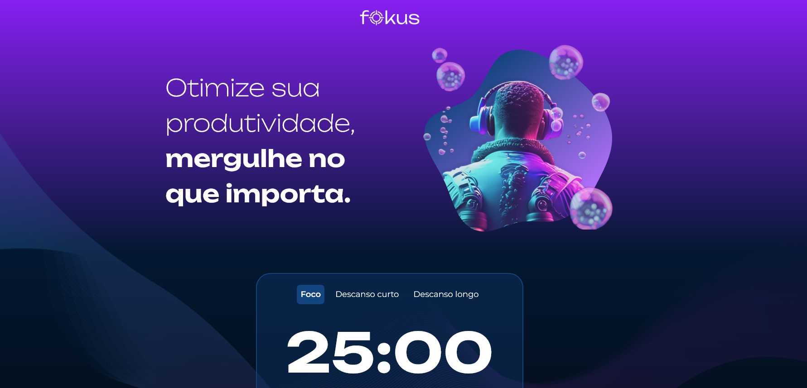

<h4 align="center"> 
	
</h4>

 <a href="#-sobre-o-projeto">Sobre</a> •
 <a href="#-funcionalidades">Funcionalidades</a> •
 <a href="#-layout">Layout</a> •
 <a href="#-tecnologias">Tecnologias</a> •
 <a href="#-autor">Autor</a> • 
 <a href="#user-content--licença">Licença</a>

# STUDIES

<h1 align="center">
    
</h1>
    

## 💻 Sobre o projeto

🚀 Fokus é um projeto inspirado na técnica Pomodoro, que visa a concentração em tarefas importantes. Dessa forma, concentrado em uma atividade por 25 minutos, por exemplo, e após esse período, é possível pausar por 5 minutos ou optar por uma pausa mais longa de 15 minutos.. 

---

## ⚙️ Funcionalidades

- [x] Contador de tempo para estudos;
- [x] Permite que o usuário escolha o tempo de pausa que desejar, seja um descanso curto ou longo;

## 🎨 Layout

O layout da aplicação está disponível no Figma: https://www.figma.com/file/dEaMv34Wd5G7TBMPo8fPlK/Projeto-Fokus?type=design&node-id=35-181&mode=design

## 📝 Aprendizados

Para construir o Projeto Fokus, utilizei vários métodos que o JavaScript oferece para manipular elementos no DOM como por exemplo:

    o InnerHTML para alterar os textos da tela;
    o setAttribute para alterar o caminho das imagens;
    o classList para alterar as classes e o estilo dos botões;
    o querySelector para pegar os elementos e
    o EventList para escutar a interação com a nossa página.

## 🛠 Tecnologias

As seguintes ferramentas foram usadas na construção do projeto:

#### **Website**

- **[Javascript](https://developer.mozilla.org/pt-BR/docs/Web/JavaScript)**
- **[CSS](https://developer.mozilla.org/pt-BR/docs/Web/CSS)**

#### **Utilitários**
- Editor: **[Visual Studio Code](https://code.visualstudio.com/)**

---

## 🦸 Autor

 <b>Rafael Corrêa</b></a> <a href="https://www.linkedin.com/in/correarafaelsantos/" title="Fokus">🚀</a>
  
👋🏽 [Entre em contato pelo Linkedin!](https://www.linkedin.com/in/correarafaelsantos/)

---
